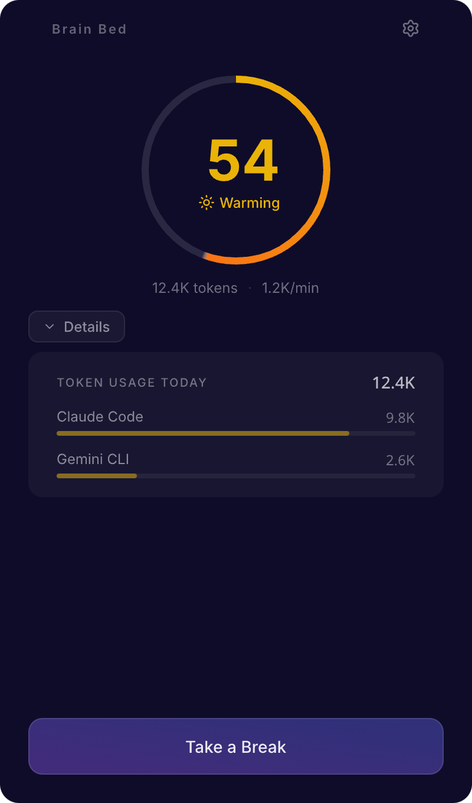
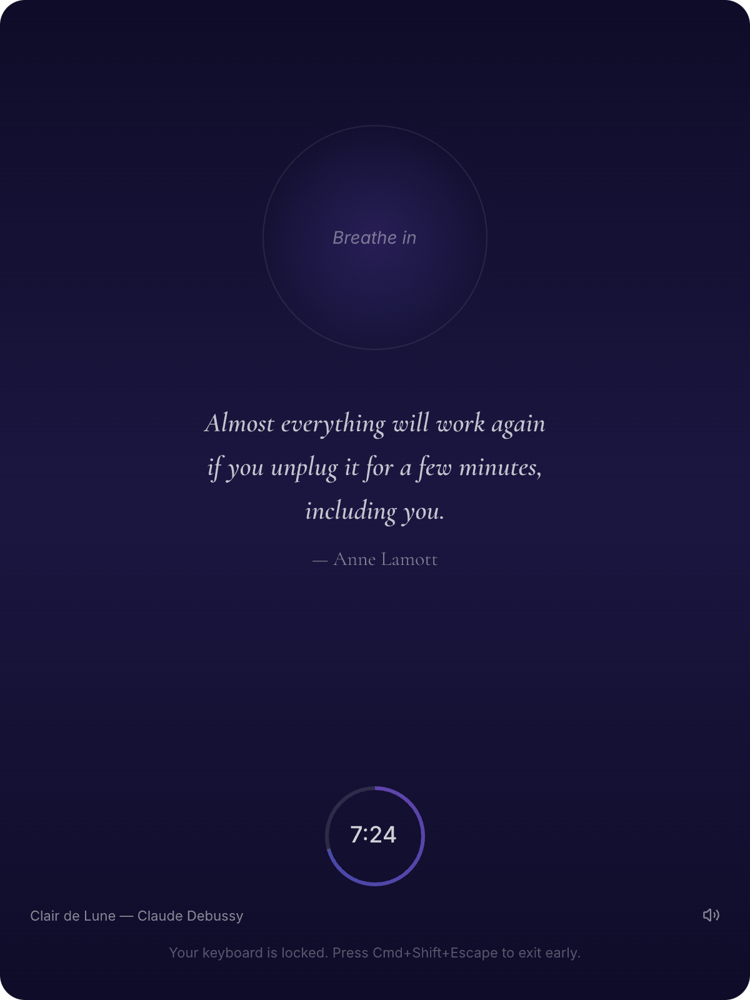

<p align="center">
  
</p>

<h1 align="center">Brain Bed</h1>

<p align="center">
  <strong>Forced meditation breaks for AI-fried brains.</strong><br/>
  Inner peace, right on your screen.
</p>

<p align="center">
  <a href="https://github.com/bbangjooo/brain-bed/releases"></a>
</p>

<p align="center">
  <a href="https://brainbed.backproach.dev">Website</a> &middot;
  <a href="https://github.com/bbangjooo/brain-bed/releases/latest">Download</a>
</p>

---

Brain Bed monitors your AI tool usage (Claude Code, Gemini CLI, Codex CLI) in real-time, calculates a **Brain Fry Index (BFI)**, and gently forces you into meditation when your cognitive load gets too high.

## Features

### Brain Fry Index (BFI)

A real-time 0–100 cognitive load score calculated from five signals:

| Factor | Weight | What it measures |
|--------|--------|------------------|
| Message Velocity | 55% | Prompts per minute (rolling 10-min window) |
| Context Switching | 15% | Project switches in 10-min window |
| Active Sessions | 10% | Number of concurrent AI tool sessions |
| Token Usage | 10% | Token throughput per minute |
| Late Night | 5% | Working between 22:00–06:00 |

**Stages:** Calm (0–29) → Warming (30–59) → Heating (60–84) → Brain Fry (85–100)

### Forced Meditation

When your BFI spikes, Brain Bed locks your keyboard and immerses you in a full-screen meditation — guided breathing, 3D visuals, classical music, and mindfulness quotes. Emergency exit via `Cmd+Shift+Esc`.

### Smart Notifications

Exponential backoff alerts — 10min → 20min → 40min → 60min cap. No notification fatigue. Meditation resets everything.

### Supported AI Tools

Reads local session logs only. No API keys, no cloud. Everything stays on your machine.

- **Claude Code** — `~/.claude/projects/` JSONL logs
- **Gemini CLI** — `~/.gemini/tmp/` chat sessions
- **Codex CLI** — `~/.codex/` JSONL logs

## Screenshots

<p align="center">
  
  &nbsp;&nbsp;
  
</p>

## Install

Download the latest `.dmg` from [Releases](https://github.com/bbangjooo/brain-bed/releases/latest).

The app is code-signed and notarized by Apple — just open and run.

**Requirements:** macOS 12+, Apple Silicon or Intel

## Development

```bash
# Install dependencies
npm install

# Start dev server (Vite + Electron)
npm run dev

# Build native keyboard blocker (requires Xcode)
npm run build:native

# Build for production
npm run build

# Build & publish to GitHub Releases
npm run release
```

## Tech Stack

- **Electron** + **React 19** + **TypeScript**
- **Vite** — build tooling
- **Three.js** / React Three Fiber — 3D meditation scene
- **Tailwind CSS** — styling
- **better-sqlite3** — local settings & session storage
- **electron-builder** — packaging & auto-update

## Settings

| Setting | Default | Description |
|---------|---------|-------------|
| Meditation duration | 10 min | 5, 10, 15, 20, or 30 minutes |
| Music autoplay | On | Classical music on meditation start |
| Force entry | Off | Auto-start meditation after 3 dismissals |
| Alert threshold | 60 min | Usage time before first alert |
| Late night window | 22:00–06:00 | Hours that trigger late-night penalty |

## Project Structure

```
electron/
  main.ts              # Main process, BFI, notifications, IPC
  bfi-calculator.ts    # BFI scoring algorithm
  activity-tracker.ts  # Usage time & idle detection
  cli-token-tracker.ts # AI tool log monitoring
  settings-store.ts    # SQLite persistence

src/
  components/
    dashboard/         # BFI gauge, stats, controls
    meditation/        # Breathing circle, 3D scene, timer, audio, quotes
    settings/          # Config panel

resources/
  audio/               # 13 classical music tracks (public domain)
  bin/                 # Native keyboard-blocker binary

native/
  keyboard-blocker/    # Swift CGEventTap keyboard interceptor
```

## License

MIT
